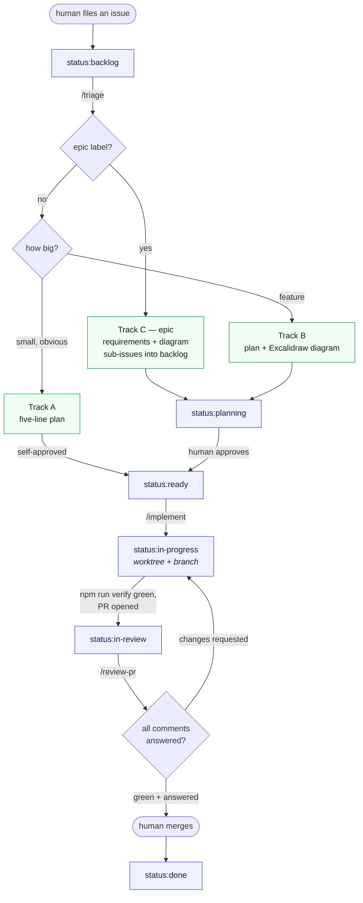

# Resumix

Resumix is a resume-tailoring workbench. The core idea: **content is global,
a resume is a selection.** Every experience, project, bullet, and skill you
have ever written lives once in the database. A "resume" doesn't store any
text of its own — it stores _which_ of that content you picked for this
application and in what order. Edit a bullet once and it updates on every
resume that uses it. Composing a resume for a new company is picking and
reordering existing content, not retyping it. When you're happy, you render
the selection into a LaTeX template and get back a PDF, which is then
snapshotted so it never silently changes underneath you later.

Multi-user, backed by Postgres and a real `pdflatex` sidecar (not a WASM
approximation — the LaTeX is the same LaTeX that compiles your actual
resume). Every experience, resume, template, and PDF belongs to exactly one
account, and accounts cannot see each other's anything. **Locally there is no
login at all** — the app signs in as the single user `npm run db:seed`
creates.

See [docs/STATE.md](docs/STATE.md) for current project status,
[docs/ARCHITECTURE.md](docs/ARCHITECTURE.md) for the full design, and
[docs/DEPLOYMENT.md](docs/DEPLOYMENT.md) for how to run this in production.

## Architecture, in one picture

```
                     ┌────────────────────────────┐
  browser ──────────▶│  Next.js (app/ + app/api)  │
   (password token   │  - React 19 UI             │
    in localStorage) │  - route handlers          │
                     │  - render engine (pure TS) │
                     └───────┬────────────┬───────┘
                             │            │
                    drizzle  │            │ POST /compile {tex}
                             ▼            ▼
                    ┌────────────┐  ┌──────────────────┐
                    │ Postgres   │  │ latex service    │
                    │ (docker)   │  │ texlive+node:http│
                    │            │  │ (docker)         │
                    └────────────┘  └──────────────────┘
```

Rendering = load your selections → substitute them into the template's
`<<TOKEN>>` placeholders → POST the resulting `.tex` to the sidecar →
get a PDF back. See [docs/ARCHITECTURE.md](docs/ARCHITECTURE.md) for the
full component table and repo layout.

## Quick start

This is the exact sequence verified against a clean checkout. It assumes
Docker Desktop (or equivalent) and Node 22+ (this repo relies on
`node --experimental-strip-types`, which needs a recent Node — v25 was used
to verify this).

```bash
git clone <this repo> && cd resumix

# 1. Environment
cp .env.example .env
# the defaults work as-is for local dev. Leaving RESUMIX_AUTH_MODE empty
# means "dev mode": no login screen, signed in as the seeded user.

# 2. Postgres + the LaTeX compile sidecar, in containers
docker compose up -d db latex
# first run builds the latex image (TeX Live), which can take a few minutes

# 3. App dependencies
npm install

# 4. Apply migrations, then seed one user + the real V1 resume as "Default"
npm run db:migrate
npm run db:seed   # creates SEED_USER_EMAIL (default: the address in the
                  # reference resume) and everything under it

# 5. Run it
npm run dev
```

Open http://localhost:3000. There is no login screen in dev mode — you land
straight on the seeded user's resume grid, showing one resume, "Default",
ready to open, edit, and re-render.

### Running with the password gate instead

To exercise the gate the way a deployment would, set `RESUMIX_AUTH_MODE=password`
in `.env` (with `APP_PASSWORD` and `AUTH_SECRET` set) and restart. You will get
the login screen, and the token it mints is bound to a specific account —
`OWNER_EMAIL`, or the only user in the table if that is unset.

### Authentication, and what is still missing

| mode                               | behaviour                                                                    |
| ---------------------------------- | ---------------------------------------------------------------------------- |
| `dev` (default locally)            | no login; session is the first user in `users`                               |
| `password` (default in production) | shared `APP_PASSWORD` → signed token naming one user                         |
| `supabase`                         | **not implemented** — the seam is `lib/auth-supabase.ts` and it fails closed |

Supabase OAuth is the intended end state. Everything downstream of "who is
this?" is already written against a `users` row, so switching over means
implementing JWT verification in that one file; no query, route, or component
changes. See `docs/API.md` ("Auth modes") and D-019.

To confirm the whole pipeline end-to-end without opening a browser:

```bash
npm run smoke
```

This reads the seeded Default resume back out of the database, renders it,
diffs the output against `docs/reference/v1-resume.tex`, and compiles it
through the real `pdflatex` sidecar — asserting a byte-faithful round trip
and a 1-page PDF. This is the project's acceptance bar (see
`docs/ARCHITECTURE.md#the-smoke-test`).

## Command reference

| Command               | What it does                                                                                                                                                                         |
| --------------------- | ------------------------------------------------------------------------------------------------------------------------------------------------------------------------------------ |
| `npm run dev`         | Next.js dev server on :3000, hot reload                                                                                                                                              |
| `npm run build`       | Production build (`next build`); also the strictest typecheck (validates App Router export signatures, not just types)                                                               |
| `npm start`           | Run the production build (`next start`)                                                                                                                                              |
| `npm test`            | Tests across `lib/**/*.test.ts` (`node --test`). Loads `.env`; the DB-backed `lib/queries` suites self-skip without `DATABASE_URL`, so expect 110 passing and 0 skipped              |
| `npm run test:e2e`    | Playwright browser tests (`e2e/**`); spins up its own dev server on :3100 and **force-reseeds the database** — see `playwright.config.ts` before running against data you care about |
| `npm run db:migrate`  | Applies any `drizzle/*.sql` files not yet recorded in `_migrations`. Idempotent — safe to re-run.                                                                                    |
| `npm run db:seed`     | Seeds the real V1 resume content + Default template + Default resume. Refuses to run twice unless you pass `--force` (wipes and reseeds)                                             |
| `npm run deploy:prod` | **Not a development command.** Deploys the separate production instance from `origin/main` onto :39000 — see [docs/DEPLOYMENT.md](docs/DEPLOYMENT.md). Refuses to run under an agent |
| `npm run smoke`       | The end-to-end check described above: DB → render → compile → assert                                                                                                                 |
| `npm run typecheck`   | `tsc --noEmit` — faster than `build`, but not sufficient on its own (see the note above)                                                                                             |
| `npm run lint`        | ESLint (`eslint.config.mjs`); `lint:fix` applies the fixable ones                                                                                                                    |
| `npm run format`      | Prettier over the tree; `format:check` is the CI/gate variant                                                                                                                        |
| `npm run verify`      | **The merge gate.** format:check → lint → typecheck → test → build → reseed → smoke → e2e. Needs `docker compose up -d db latex`                                                     |

`test`, `db:migrate`, `db:seed`, and `smoke` load `.env` automatically (via Node's
`--env-file-if-exists`) if one is present, and fall back to whatever is
already in your shell environment otherwise — so they work the same way
locally and in CI/production where env vars are injected directly.

## How work gets done here

This repo is maintained largely by AI agents, and the process is part of the
repo rather than a convention someone remembers. Every piece of work a **human**
asks for is one GitHub issue — agents never file their own — and that issue's
`status:*` label is the only record of where it stands.

Three skills in `.claude/skills/` each drive one phase, and a human invokes
each by hand. They never call each other, so every phase boundary is a
deliberate decision rather than a runaway chain.



That is the **unattended** path, where the label has to carry the whole
conversation. Working alongside an agent in a session is lighter: approval
happens by saying so, a new request extends the issue you are already on
rather than spawning another, and the agent goes straight to worktree, branch
and PR while moving the label as it passes each step.

Either way two transitions are deliberately **not** automated. A human moves
`planning → ready` — that move _is_ the approval, and it is the one an agent
may never make itself. And a human presses merge. Everything else is either an
agent setting a label through `scripts/status.sh`, or
`.github/workflows/status.yml` reacting to a PR event.

`ready` and `in-progress` look redundant and are not: `ready` means the plan
is approved, `in-progress` means an agent has actually claimed it. Keeping them
apart is what makes a queue of approved-but-unstarted work visible.

## Project layout

```
app/                     Next.js App Router (pages + app/api/** route handlers)
lib/                     db schema/client, render engine, auth, queries, storage
components/              React components
drizzle/                 numbered .sql migrations
scripts/                 migrate.ts, seed.ts, smoke.ts, status.sh
services/latex/          the pdflatex sidecar (Dockerfile + server.js)
e2e/                     Playwright specs
docs/                    architecture, contracts, decisions, deployment — see below
.claude/skills/          triage, implement, review-pr — the lifecycle above
```

## Where to go next

- [docs/STATE.md](docs/STATE.md) — what's built
- [docs/ARCHITECTURE.md](docs/ARCHITECTURE.md) — components, repo layout, the smoke test
- [docs/SCHEMA.md](docs/SCHEMA.md), [docs/API.md](docs/API.md), [docs/TEMPLATE_TOKENS.md](docs/TEMPLATE_TOKENS.md) — frozen contracts
- [docs/DECISIONS.md](docs/DECISIONS.md) — why things are the way they are
- [docs/DEPLOYMENT.md](docs/DEPLOYMENT.md) — the production instance: `npm run deploy:prod`, step by step
- [docs/CONTRIBUTING.md](docs/CONTRIBUTING.md) — adding a migration, an endpoint, running the smoke test
- [CLAUDE.md](CLAUDE.md) — guide for an AI agent picking this repo up cold
- `services/latex/README.md` — the sidecar's own contract, security notes, and Fly.io deploy notes
